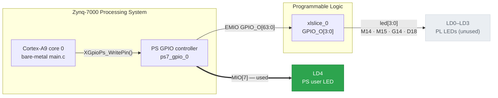

# Zybo Z7-20 — Bare-Metal LED Blink (Vivado + Vitis)


A minimal, complete Zynq-7000 SoC bring-up: a Vivado block design that configures the
Processing System, an exported hardware handoff (`.xsa`), and a bare-metal C application
that blinks the board's PS-connected user LED from an ARM Cortex-A9 core.

This is deliberately the smallest project that exercises the *whole* Zynq flow end to end.
There is no bitstream magic and no HDL to write — the point is the hand-off between
**hardware (Vivado) → platform (XSA) → firmware (Vitis) → silicon**.

**Everything needed to reproduce it is in this repository, including the pre-built `.xsa`,
so you can go from `git clone` to a blinking LED without opening Vivado at all.**

---

## What this demonstrates

- Configuring the Zynq-7000 Processing System (DDR3, clocks, MIO pin muxing) from a board preset
- Exporting hardware from Vivado as an `.xsa` and consuming it as a Vitis platform
- Writing bare-metal firmware against the AMD standalone BSP (`XGpioPs` driver)
- Understanding the **MIO vs. EMIO** split — which pins the PS owns directly, and which
  it has to reach through the programmable logic
- Bringing up a board over JTAG and debugging why an LED *doesn't* light

---

## Behaviour

Once running, **LD4** — the single user LED wired directly to the Processing System —
blinks continuously: on for ~500 ms, off for ~50 ms.

The four PL-connected LEDs (LD0–LD3) stay off. They are wired up in hardware but the
firmware does not drive them; see [Known limitations](#known-limitations--next-steps).

---

## Repository layout

```
zybo-led-blink/
├── hw/vivado/
│   ├── design_LED_wrapper.xsa        # Exported hardware handoff — import this into Vitis
│   ├── scripts/
│   │   └── LED_BLink.tcl             # Vivado project-recreation script (see caveat below)
│   └── src/
│       ├── hdl/
│       │   ├── design_LED_wrapper.v    # Generated block-design wrapper (Verilog)
│       │   └── design_LED_wrapper.vhd  # Generated block-design wrapper (VHDL)
│       ├── ip/                       # Block-design IP configurations (.xci)
│       │   ├── design_LED_processing_system7_0_0/
│       │   ├── design_LED_proc_sys_reset_0_0/
│       │   ├── design_LED_util_vector_logic_0_0/
│       │   └── design_LED_xlconstant_0_0/
│       └── zybo_led.xdc              # Pin constraints for the PL LEDs
└── sw/app/
    └── src/
        └── main.c                    # Bare-metal firmware — the blink itself
```

---

## Hardware architecture

The block design instantiates the Zynq PS and routes GPIO out along **two independent paths**:



Supporting blocks: a `proc_sys_reset` fed by an inverted `FCLK_RESET0_N`
(`util_vector_logic` as a NOT gate) with `dcm_locked` tied high by an `xlconstant`.
They are present for a conventional, extensible reset topology; this design's LED path
does not consume their outputs.

### LED map

| LED       | Path | Zynq pin / signal          | Package pin        | Driven by this firmware |
|-----------|------|----------------------------|--------------------|-------------------------|
| **LD4**   | PS   | `MIO[7]`                   | — (dedicated MIO)  | ✅ yes                  |
| LD0       | PL   | `led[0]` ← `EMIO GPIO[0]`  | M14                | ❌ no                   |
| LD1       | PL   | `led[1]` ← `EMIO GPIO[1]`  | M15                | ❌ no                   |
| LD2       | PL   | `led[2]` ← `EMIO GPIO[2]`  | G14                | ❌ no                   |
| LD3       | PL   | `led[3]` ← `EMIO GPIO[3]`  | D18                | ❌ no                   |

All user LEDs are **active high** — anode-connected to the Zynq through 330 Ω resistors,
so driving a pin HIGH lights the LED.

> **Worth noting:** because LD4 hangs off a dedicated MIO pin, it is driven entirely by the
> PS. The PL bitstream is not required for this blink to work — `ps7_init` sets up the MIO
> muxing, and the Cortex-A9 does the rest. Programming the PL only matters once you want
> LD0–LD3.

---

## Getting started

### Requirements

| Item            | Requirement                                                                             |
|-----------------|-----------------------------------------------------------------------------------------|
| **Board**       | Digilent Zybo Z7-20 (`xc7z020clg400-1`)                                                 |
| **Tools**       | AMD Vitis Unified IDE 2025.2 (Vivado only needed to *rebuild* the hardware)              |
| **Cable**       | micro-USB, into the **PROG/UART** port (J12)                                             |
| **Board files** | [Digilent board files](https://github.com/Digilent/vivado-boards) — Vivado rebuild only |

### Option A — Flash it and go (recommended)

You do not need Vivado. The exported `.xsa` in this repo is all Vitis needs.

**1. Prepare the board**

- Set the **JP5** mode jumper to **JTAG**
- Connect the micro-USB cable to **J12 (PROG/UART)**
- Power on (**SW4**)

**2. Create the platform from the exported hardware**

- Launch **Vitis Unified IDE 2025.2** and pick a workspace directory
- **File → New Component → Platform**
- Name it e.g. `zybo_led_platform`
- For the hardware description, browse to **`hw/vivado/design_LED_wrapper.xsa`**
- Operating system: **standalone**, Processor: **`ps7_cortexa9_0`**
- Build the platform component (**Build** in its Flow view)

**3. Create the application**

- **File → New Component → Application**
- Name it e.g. `zybo_led_app`, and select the platform you just built
- Domain: **`standalone_ps7_cortexa9_0`**
- Delete the generated placeholder source, and add **`sw/app/src/main.c`** to the
  component's `src/` directory
- Build the application component

**4. Run on hardware**

- **Run → Run** (or *Run* in the application's Flow view)
- Vitis programs the PL, applies `ps7_init`, downloads the `.elf`, and starts the core

**LD4 starts blinking.** 🎉

> Using classic Vitis (2023.1 or older)? The equivalent steps are
> *File → New → Platform Project → from XSA*, then *File → New → Application Project*.

### Option B — Rebuild the hardware in Vivado

Only needed if you want to modify the block design.

> ⚠️ **Caveat:** `hw/vivado/scripts/LED_BLink.tcl` was produced by Vivado's
> `write_project_tcl` on the original development machine. It calls `checkRequiredFiles`
> for a synthesis checkpoint (`design_LED_wrapper.dcp`) and constraints at paths *outside*
> this repository (`.../Master_Thesis/LED_BLink/...`), so running it on a fresh clone stops
> with `Could not find local file …`. Treat it as a **record of the design** rather than a
> one-click rebuild.

To rebuild from scratch: create a project for `xc7z020clg400-1`, add the ZYNQ7 Processing
System with the Zybo Z7-20 preset, enable **GPIO MIO** and **GPIO EMIO (64-bit)**, slice
`GPIO_O[3:0]` out to a `led[3:0]` port, add `hw/vivado/src/zybo_led.xdc`, then generate a
bitstream and **File → Export → Export Hardware** (*include bitstream*).

---

## Troubleshooting

| Symptom | Cause and fix |
|---|---|
| No LED, app exits immediately with `-1` | `XGpioPs_LookupConfig()` returned `NULL` — the platform was built from a different XSA, or the GPIO peripheral isn't in it. Rebuild the platform from `design_LED_wrapper.xsa`. |
| `XGpioPs_LookupConfig()` returns `NULL` on Vitis 2023.2+ | The system-device-tree flow changed this argument from a *device ID* to a *base address*. Pass `XPAR_XGPIOPS_0_BASEADDR` instead of `0`. |
| Code runs, LED never lights | The output driver was never enabled. Both `XGpioPs_SetDirectionPin()` **and** `XGpioPs_SetOutputEnablePin()` are required — with only the first, the pin stays high-impedance and fails silently. |
| "No hardware targets available" | JP5 isn't on **JTAG**, the cable is in the wrong USB port (use **J12**), the board isn't powered, or the Digilent USB drivers aren't installed. |
| Vitis can't select the platform | Build the **platform** component before creating the application. |
| Vivado TCL fails: `Could not find local file …` | Expected — see the caveat in Option B. Use the `.xsa` instead. |

---

## Known limitations / next steps

- **LD0–LD3 are wired but unused.** The EMIO path to the four PL LEDs is fully built in
  hardware; the firmware only drives `MIO[7]`. Driving them means writing to the EMIO bank
  (pin numbers ≥ 54 in `XGpioPs`) — a natural next commit, e.g. a running-light pattern.
- **The blink is asymmetric** (~500 ms on, ~50 ms off) rather than a symmetric 1 Hz.
- **`zybo_led.xdc` constrains a `clk` port that the block design does not expose.** It is
  left over from Digilent's master XDC (where the signal is named `sysclk`). Vivado
  resolves `get_ports {clk}` to nothing and warns; harmless, but it should be removed.
- **Delays are busy-waits.** `usleep()` blocks the core. A TTC hardware timer or an
  interrupt-driven approach would be the idiomatic step up.

---

## References

- [Zybo Z7 Reference Manual](https://digilent.com/reference/programmable-logic/zybo-z7/reference-manual) — board I/O, MIO map, boot modes
- [Digilent XDC master files](https://github.com/Digilent/digilent-xdc) — canonical pin constraints
- [Zynq-7000 SoC Technical Reference Manual (UG585)](https://docs.amd.com/r/en-US/ug585-zynq-7000-SoC-TRM) — GPIO controller, chapter 14
- [OS and Libraries Document Collection (UG643)](https://docs.amd.com/r/en-US/oslib_rm) — `XGpioPs` standalone driver API
